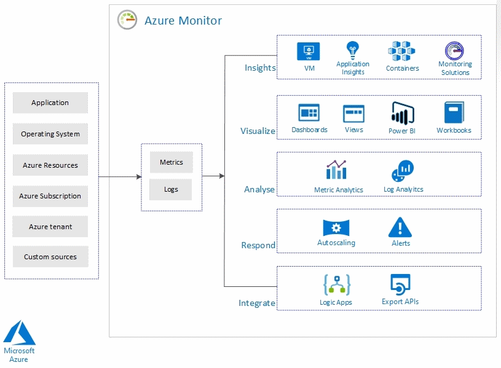

- Azure Monitor
- Metrics and Alerts
- Baseline for resources
- Diagnostic settings on resources
- Alerts in Log Analytics
- Utilizing log search query functions

### Azure Monitor

- Collecting, Analyzing, Acting on telemerty from the cloud and on-premises env.
- Data collected by azure monitor fits into two type: Metrics and Logs.
- Metrics是系统在特定时间的某个指标的值。
- Logs 则是 records.

azure monitor provide the following metrics and logs:

- Application monitoring data
- Guest OS monitoring data
- Azure Resource Monitoring data
- Azure subscription monitoring data
- Azure tenant monitoring data

### mertics (指标)

- Analyzing via chart
- Visualizing 
- Alerting
- Automating: To increase and decrease resources based on metrics values.
- Exporting: 通过 event hub route到外部系统
- Retrieving: can be retrieved from command line using powershell or cli.
- Archiving: Can be archived in azure storage.

四大指标： 平台指标， guest os 指标，应用指标，custom metrics

要查看资源的指标，可以在资源下面的“监视 - 指标”中查到。

multi-dimensional metrics

### Alerts

一个Alert需要三个部分。Resource, Condition, Action Group
Alerts可以给某个资源，配置一些规则，让它在某些条件达到的情况下触发一些操作。
比如 “当 percentage cpu 大于 70%” 时给某个人发邮件。

### Baseline

- To create baseline for your resources, Azure offers Metric Alerts with Dynamic Thresholds.
- You don't have to set threshold for alerts with that.

### Diagnostic settings

There are two type of diagnostic logs available in azure monitor

- Tenant Logs
- Resource Logs

The logs that can be accessed are stored inside a storage account and can be used for auditing or manual inspection purposes.

- 启动诊断
- 创建storage account

### Log Analytics

- create a "log analystic workspace" resource
- Go to "Azure monitor" -> "insights / more" -> "logs"
- Write kusto

### query logs

kusto query language

